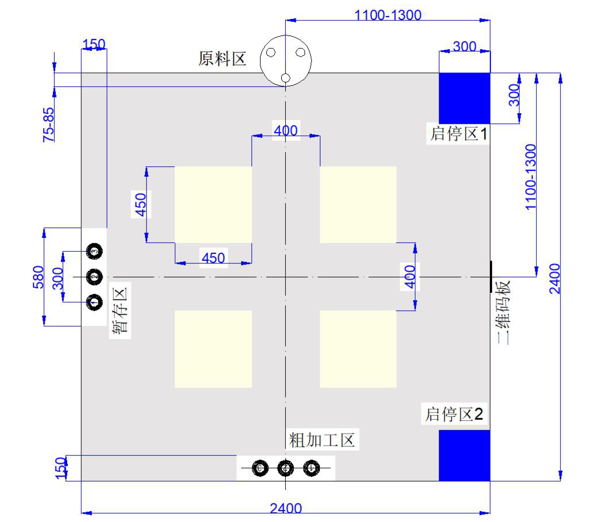

<!-- .slide: class="cover" -->

## 让机器人按场地坐标行走

<p class="subtitle">目标点 → 换算车身方向 → 四轮执行 → 更新位置</p>

<div class="accent-line"></div>

<aside class="notes">
我们只知道场地坐标，但机器人转向以后，怎么仍然知道应该往哪里走？
</aside>

---

## 地图说“去哪里”，底盘判断“怎么走”

<p class="lead">场地坐标不会动，但机器人自己的前后左右会随着转向改变。</p>

<div class="flow">
  <div class="step">
    <b>① 目标减当前位置</b>
    <span>moveWorldTo()</span>
    <p>先算出目标还在<br>场地中的哪个方向</p>
  </div>
  <i>→</i>
  <div class="step">
    <b>② 换成车身方向</b>
    <span>worldToBody()</span>
    <p>结合当前车头朝向<br>算出前进和横移</p>
  </div>
  <i>→</i>
  <div class="step">
    <b>③ 分给四个轮子</b>
    <span>moveBodyRelative()</span>
    <p>把前进、横移组合成<br>每个轮子的行程</p>
  </div>
</div>

<div class="key-insight">
  <div><b>路线与朝向解耦</b><span>同一个目标点，不需要为不同车头方向重写路线。</span></div>
  <div><b>统一单位</b><span>路线、位姿和工位坐标全部使用毫米。</span></div>
  <div><b>统一入口</b><span>快速转场和精确靠站共用 moveWorldTo()。</span></div>
</div>

<p class="hint">↓ 向下展开：坐标变换代码</p>

<aside class="notes">
路线只说地图上的目标点；底盘先看目标与当前位置的差，再看车头朝向，把它翻译成“向前多少、向右多少”，最后才交给四个麦轮。
</aside>

----

<!-- .slide: class="code-slide" -->

## 代码里怎样完成这次“翻译”

<div class="matrix-demo">
  <div class="vector">forward<br>right</div>
  <span>=</span>
  <div class="matrix">
    <span>sin θ</span><span>cos θ</span>
    <span>−cos θ</span><span>sin θ</span>
  </div>
  <div class="vector">dx<br>dy</div>
  <div class="matrix-examples">
    <b>θ = 0°</b>：地图 +y 就是向前<br>
    <b>θ = 90°</b>：地图 +x 就是向前
  </div>
</div>

```cpp
const float rad = yawDeg * PI / 180.0f;
forward =  sinf(rad) * dx + cosf(rad) * dy;
right   = -cosf(rad) * dx + sinf(rad) * dy;
```

<p class="code-note">矩阵没有改变目标点，只是换了一个观察方向。</p>

<div class="mini-facts">
  <div><b>输入</b><span>地图位移 dx、dy + 当前 yaw</span></div>
  <div><b>输出</b><span>底盘能够直接执行的 forward、right</span></div>
</div>

<aside class="notes">
这段代码做的事情很简单：同一个地图方向，在机器人转向以后，会变成不同的前进和横移比例。yaw 为零时，地图正 y 就是向前，地图正 x 则是向左。
</aside>

----

<!-- .slide: class="example-slide" -->

## 实际场地：中心点前往原料区


<div class="matrix-demo field-matrix">
  <div class="vector">forward<br>right</div>
  <span>=</span>
  <div class="matrix">
    <span>sin 90°</span><span>cos 90°</span>
    <span>−cos 90°</span><span>sin 90°</span>
  </div>
  <div class="vector">0<br>980</div>
</div>

<div class="field-layout">
  <div class="field-map">
    
    <div class="route-line"></div>
    <div class="map-point center-point"><i></i><span>中心<br>(1200, 1200)</span></div>
    <div class="map-point material-point"><i></i><span>原料区<br>(1200, 2180)</span></div>
  </div>
  <div class="field-calc">
    <div>
      <span>世界坐标差</span>
      <code>dx = 1200 − 1200 = 0<br>dy = 2180 − 1200 = 980</code>
    </div>
    <div>
      <span>中心转向后 yaw = 90°</span>
      <code>forward = 1×0 + 0×980 = 0<br>right = −0×0 + 1×980 = 980</code>
    </div>
    <div>
      <span>四轮目标行程</span>
      <code>左前 / 右后 = +980 mm<br>右前 / 左后 = −980 mm</code>
    </div>
    <strong>结果：车头保持 90°，底盘向右横移 980 mm。</strong>
  </div>
</div>


<aside class="notes">
使用项目中的真实路线：机器人在场地中心点一千二、一千二，原料区基准点是一千二、两千一百八。世界坐标上只增加了九百八十毫米的 y。机器人在中心转到九十度后，车头方向对应世界正 x，因此这段世界正 y 位移会被换算为向右横移九百八十毫米。四个麦轮分成正负两组，完成纯横移。

[Sources]
场地图：用户提供的“搬运地图带尺寸.png”
坐标：include/field_config.h、lib/MissionControl/MissionRoutes.h
</aside>

---

## 走完以后，还要更新“我在哪里”

<div class="choices">
  <div class="choice">
    <em>01</em>
    <b>轮子走了多少</b>
    <p>把四个电机产生的脉冲换算成实际行程。</p>
  </div>
  <div class="choice">
    <em>02</em>
    <b>车身移动多少</b>
    <p>组合四轮行程，算出机器人前进和横移了多少。</p>
  </div>
  <div class="choice">
    <em>03</em>
    <b>地图位置在哪里</b>
    <p>结合 IMU 车头角度，把这段移动加回场地坐标。</p>
  </div>
</div>

<div class="odometry-formula">
  <span>forward = (LF + RF + LR + RR) / 4</span>
  <span>right = (LF − RF − LR + RR) / 4</span>
</div>

<div class="loop-line">世界目标　→　车体运动　→　四轮脉冲　→　世界位姿</div>

<p class="hint">↓ 向下展开：里程计更新代码</p>

<aside class="notes">
发出命令只是前半段，走完还要更新当前位置。系统先看四个轮子实际走了多少，恢复出整车的前进和横移，再结合车头角度加回地图坐标。这样下一段路线才能继续从新的位置计算。
</aside>

----

<!-- .slide: class="code-slide" -->

## 代码里怎样把运动记回地图

```cpp
// 麦轮正解：四轮行程 → 车体位移
forward = (lf + rf + lr + rr) * 0.25f;
right   = (lf - rf - lr + rr) * 0.25f;

// 结合 IMU 航向：车体位移 → 世界位移
worldX = sinf(rad) * forward - cosf(rad) * right;
worldY = cosf(rad) * forward + sinf(rad) * right;

pose.x += worldX;
pose.y += worldY;
pose.yaw = imuYaw - yawOffset;
```

<p class="code-note">旋转分量由 IMU 记录，轮脉冲只用于累计 x / y 平移。</p>

<div class="mini-facts">
  <div><b>每轮 update()</b><span>读取新增脉冲，避免一次动作结束后才更新位置。</span></div>
  <div><b>两类传感来源</b><span>x / y 来自轮脉冲，yaw 来自 IMU。</span></div>
</div>

<aside class="notes">
前四行先回答“机器人相对自己移动了多少”，后几行再回答“这段移动在地图上对应多少”。每次 update 都会累计一次。
</aside>

---

## 这套方法准确到什么程度

<div class="takeaways">
  <div>
    <span>车头方向</span>
    <b>由 IMU 测量</b>
    <p>启动时记录偏差，让 IMU 角度和场地方向对齐。</p>
  </div>
  <div>
    <span>场地位置</span>
    <b>由轮子推算</b>
    <p>通过轮子直径和电机微分数，可以解算出走出一段实际距离所需要的脉冲数，实现无打滑状态下的准确位移。</p>
  </div>
  <div>
    <span>消除误差</span>
    <b>用地标校正</b>
    <p>到达粗加工或者暂存区后，同时视觉上的对齐圆环，可以把当前位置重新写成提前标定好的准确坐标。</p>
  </div>
</div>
<blockquote>一句话总结：路线看地图，底盘看车头，轮子负责执行。</blockquote>

<aside class="notes">
它并不是完全不会漂移：车头方向由 IMU 测量，位置由轮子推算，麦轮打滑会产生累计误差。因此到达已知工位后可以重新校正位置。最大的价值是路线始终用同一张“地图”，不需要关心机器人当时朝向哪里。
</aside>
